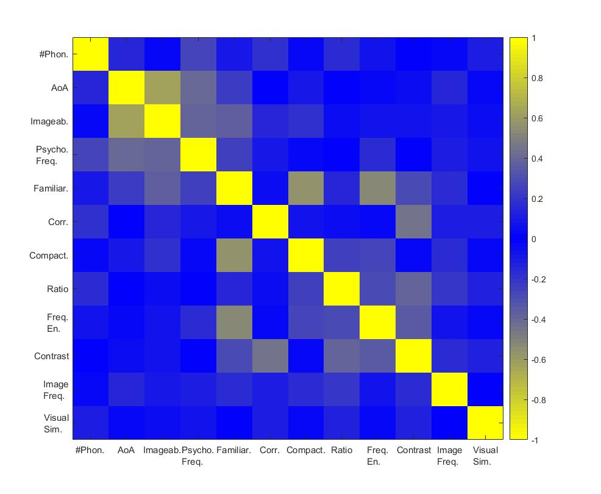
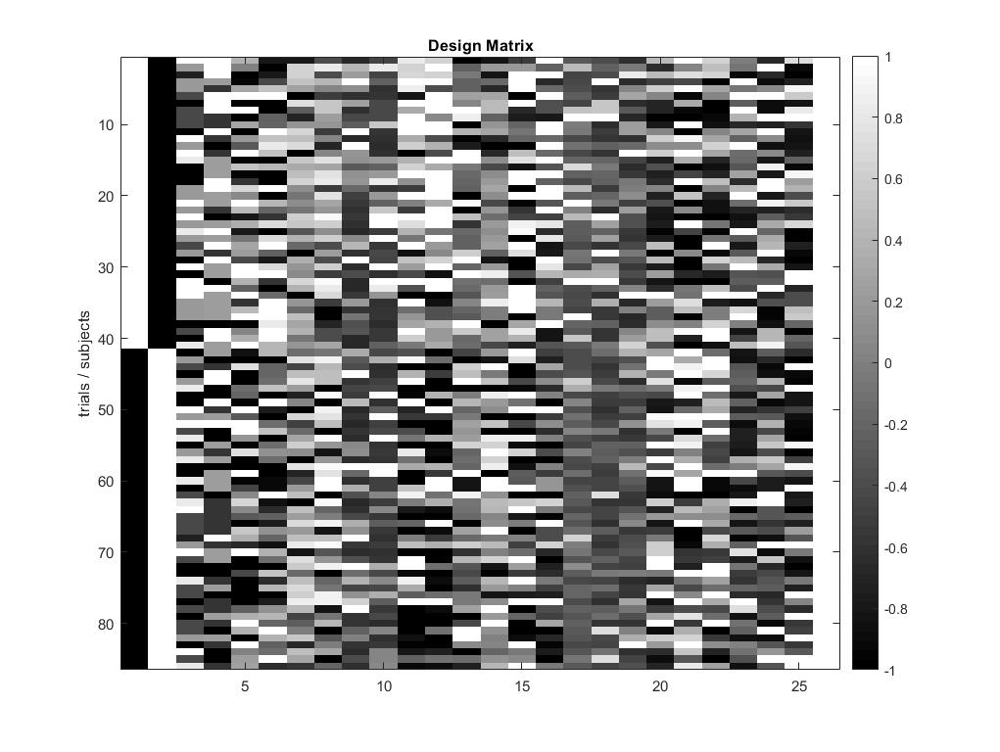
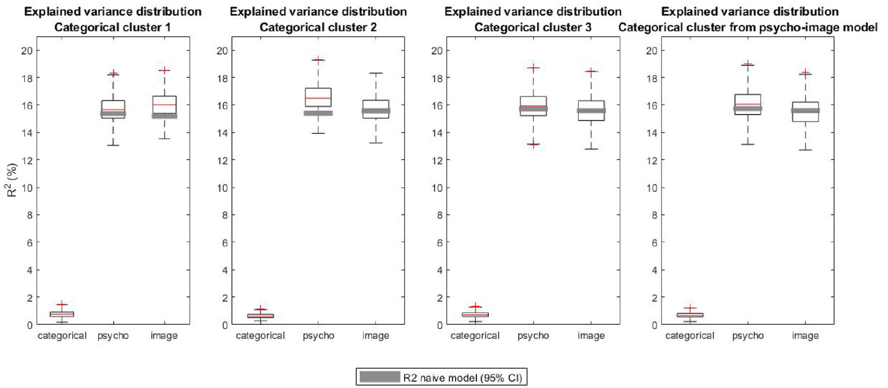

# Covariates_Analysis

This repository is linked to the publication: 

[La Fisca et. al., "Biases in BCI Experiments: Do we really need to balance stimulus properties across categories?", Frontiers in Computational Neuroscience, Volume 16, Pages 153-172, 22 November 2022](https://www.frontiersin.org/articles/10.3389/fncom.2022.900571/full)

All descriptions and computations of covariates related to image visual features can be found in the [utils](https://github.com/numediart/Covariates_Analysis/blob/main/utils/Readme.md) folder.

## Requirements
- [FieldTrip](https://github.com/fieldtrip/fieldtrip.git)
- [LIMO-for-FieldTrip](https://github.com/LucaLaFisca/LIMO-for-FieldTrip.git)
- [limo_tools](https://github.com/LIMO-EEG-Toolbox/limo_tools.git)

If you want to run the code as it is, you should download the corresponding dataset from [Zenodo](https://zenodo.org/records/7298746#.Y2kKIXbMK3A)

### Fit BIDS format
The provided code reads data following the [BIDS format](https://bids.neuroimaging.io/index.html).
Edit your dataset to fit this format. Example:
```
/
├── dataset_description.json
├── participants.tsv
├── README
├── CHANGES
├── sub-001
│   └── eeg
│       ├── sub-001_task-xxx_eeg.bdf
│       ├── sub-001_task-xxx_eeg.json
│       └── sub-001_task-xxx_events.tsv
├── sub-002
├── ...
├── derivatives
│   └── preproc_and_segment
│       ├── dataset_description.json
│       ├── sub-001
│       │   └── eeg
│       │       ├── sub-001_preprocessed.mat
│       │       ├── sub-001_timelock.mat
│       │       └── sub-001_timelock.json
│       ├── sub-002
│       └── ...
```

## Tutorial
### 1. Configuration of the study
Adapt the config.json file to your data.

a) Information about the study:
```
"model_names"		 	: "model_cat,model_psycho,model_image,model_psycho_image",
"model_names_naive" 		: "model_psycho,model_image,model_psycho_image",
"save_choice" 			: true,
"SOURCE_ANALYSIS" 		: false,
"task_name" 			: "semanticPriming",
"datatype"			: "bdf",
"comment_datatype"		: "bdf, edf or mat",
```

b) Information about the paths:
```
"PATH_TO_ROOT" 			: "D:/__EEG-data/BIDS_files",
"PATH_TO_FIELDTRIP" 		: "D:/FieldTrip",
"PATH_TO_LIMO" 			: "D:/_LIMO/limo_tools",	
"PATH_TO_FT2LIMO" 		: "D:/_LIMO/LIMO-for-FieldTrip",
"PATH_TO_SOURCE" 		: "D:/__EEG-data/BIDS_source",
```

c) Information about the confounders:
```
"PATH_TO_COV_ANALYSIS" 		: "C:/Users/luca-/OneDrive - UMONS/_PhD/__GitHub/Covariates_Analysis",
"PATH_TO_IMAGES" 		: "D:/_ARC-images/ARC_tache_Final/300x300",
"PATH_TO_SIMILARITY" 		: "utils/visual_similarity.csv",
"PATH_TO_ITEMS" 		: "utils/items_description.csv",
"cov_description" 		: "utils/continuous_variables.csv",
"comment_cov_descript." 	: "give the path to the csv file containing the values of the studied confounders",	
```

d) Information about the trials:
```
"trial_function" 		: "SenSem_trialfun_trial",
"comment_trial_function"	: "replace with the desired trial function (cf. FieldTrip doc)",
"trialdef_eventtype"		: "STATUS",
"trialdef_eventvalue" 		: [10, 11, 12],
"trialdef_prestim"		: 0.5,
"trialdef_poststim"		: 1,
"trial_start" 			: -200,
"trial_end" 			: 500,
"comment_trial" 		: "in ms",
```
Note: the trial function ```SenSem_trialfun_trial.m``` incorporates the confounder values to the "eeg_raw" structure. Have a look at this function in the [utils](https://github.com/numediart/Covariates_Analysis/blob/main/utils/) folder to adapt it to your data.

e) Information for the source analysis:
```
"atlas"					: "template/atlas.mat",
"headmodel"				: "template/vol.mat",
"elec"					: "template/elec.mat",
"channels"				: "[1:64]"
```

### 2. Selection of the confounders to study
The function ```var_selection(config)```, that can be found in [utils](https://github.com/numediart/Covariates_Analysis/blob/main/utils/) folder, performs a correlation analysis of the different confounders defined in the csv file provided in "cov_description".

This function, as well as the ```extract_cov``` has been specifically designed for our dataset. You should modify them to fit your data.

This step will provide the following type of figure to study the correlation between the confounders:


From that, you can select the targeted confounders for each model in the "selected_regressors" variable (line 56) as:
```
selected_regressors = {[],4:13,14:26,4:26}; % the regressors corresponding to each model_name
```

### 3. Create the models using design matrices
Different models cat be created depending on the confounder types you want to study. To perform the same analysis as proposed here, you should have at least 2 different types of confounders (here, psycho-linguistic variables and image features).

The models should be defined in the following order:
- (1) model for categorical variables (no confounder)
- (2) model for 1st confounder type
- ...
- (n+1) model for nth confounder type
- (last) model with all the confounders

This step creates a design matrix for each subject looking like the following figure:

With the 2 first rows representing the categories and the rest being the confounder values.

By the same process, naive models are created to further analyze the effect of the increase of dimensionality (cf. paper).

### 4. Linear Modeling (1st level avalysis)
Using the design matrices and the LIMO EEG toolbox, we perform the linear modeling of the EEG data through:
```
contrast.mat = [1 -1 0]; % 1st column vs. 2nd column
option = 'both'; % model both the categories (contrast) and the confounders
[LIMO_files, procstatus] = limo_batch(option,model,contrast);
```

### 5. Statistical Analysis (2nd level analysis)
The regions of high categorical contrast and high explained variance are identified using the 2nd level analysis provided by the LIMO EEG toolbox:
```
% categorical contrast
my_param = 'con_1';
LIMOfiles = fullfile(PATH_TO_ROOT,sprintf('%s_files_GLM_OLS_Time_Channels_%s.txt',my_param,model_name));
LIMOPath = limo_random_select('one sample t-test',expected_chanlocs,'LIMOfiles',... 
    LIMOfiles,'analysis_type','Full scalp analysis',...
    'type','Channels','nboot',100,'tfce',1,'skip design check','yes');
p = 0.05;
MCC = 3; % TFCE
load('LIMO.mat')
[~, mask, ~] = limo_stat_values('one_sample_ttest_parameter_1.mat',p,MCC,LIMO);

% explained variance
limo_random_robust(3,absolute_R2,naive_R2,1,LIMO) % perform the t-test
p = 0.05;
MCC = 2; % MCC
load('LIMO.mat')
[~, mask, ~] = limo_stat_values('paired_samples_ttest_parameter_1.mat',p,MCC,LIMO);
```

For each cluster of significant contrast, we compute the trimmed mean of the corrected R2 values obtained by combination between models:
```
load(fullfile(PATH_TO_DERIV,['mask_' model_name '.mat'])) % load the targeted mask
TmR2 = cell(0);
load(fullfile(PATH_TO_DERIV,[model_names{end} '_absolute_R2.mat'])) % load R2 values of the complete model
R2_all_cov = absolute_R2;
for k = 1:length(model_names)-1
    load(fullfile(PATH_TO_DERIV,[model_names{k} '_absolute_R2.mat'])) % load the corresponding R2 values
    if k > 1 % no need to subtract for categorical model
        R2 = R2_all_cov - absolute_R2;
        TmR2{end+1} = limo_trimmed_mean(R2,20,0.05);
    else
        TmR2{end+1} = limo_trimmed_mean(absolute_R2,20,0.05);
    end
    tmp = TmR2{end}(:,:,2);
    tmp(~mask) = nan;
    TmR2{end} = tmp(:);
    TmR2{end} = TmR2{end}(~isnan(TmR2{end}));
end
```

You can therefore display the boxplot of the explained variance of each and compare it to the naive models to consider the effect of increasing the dimensionality of the model, like in the following figure:


### 6. Effects Separability
Finally, by combining the explained variance of different models, as explained in Figure 9 of our paper, we can retrieve the loss in explained variance that is due to the correlation between the confounders and the categories (R2_loss):
```
% Here is the example of the R2 loss between categories and psycho covariates. Adapt it to your data.

% 1) "computed" psycho effect
load(fullfile(PATH_TO_DERIV,[model_names{end} '_absolute_R2.mat'])) % load R2 values of the psycho-image model
R2_all_cov = absolute_R2;
load(fullfile(PATH_TO_DERIV,[model_names{3} '_absolute_R2.mat'])) % load R2 values of the image model
R2_computed_psycho = R2_all_cov - absolute_R2;

% 2) "computed" categorical effect
load(fullfile(PATH_TO_DERIV,[model_names{2} '_absolute_R2.mat'])) % load R2 values of the psycho model
R2_computed_cat = absolute_R2 - R2_computed_psycho;

% 3) R2 loss
load(fullfile(PATH_TO_DERIV,[model_names{1} '_absolute_R2.mat'])) % load R2 values of the categorical model
R2_loss = absolute_R2 - R2_computed_cat;
```

If the R2 loss of the model is high, relatively to the explained variance of the categorical model, the effect of the corresponding confounders cannot be separated from the categorical effect. Therefore, the confounders should be balanced across categories. If not, this balance is not necessary.
